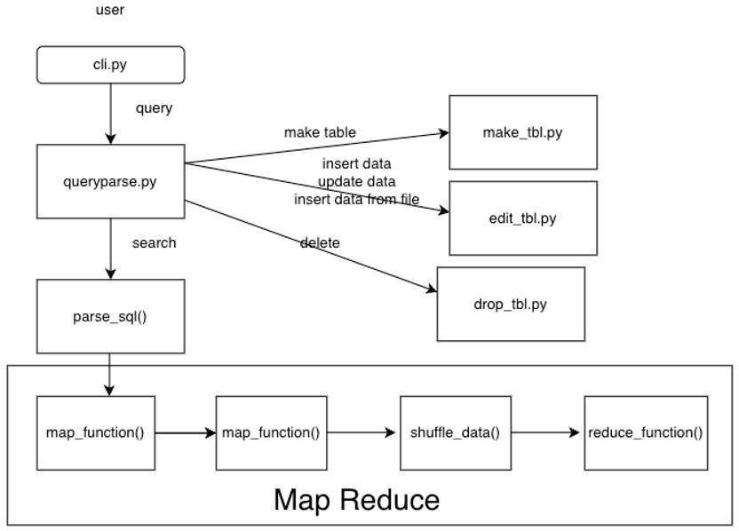

# 551 project

### file structure


### Installation
To set up the project environment:
```
pip install -r requirements.txt
```
This will install all the necessary Python packages listed in requirements.txt.

### Getting Started
To begin using the database system, start by creating and using databases:

```
makedb test2
usedb test2
makedb test3
showdb
```
### To manage databases and tables:
```
dropdb test3
usedb test2
make try COLUMNS a=int, b=str
make COPY try tryt
```
### To insert and manipulate data:

```
edit try insert a=1 b="abc"
edit try update id=0 b="abcdefg"
edit try delete id=0
fetch try *
```
### To manage load data from CSV files:

```
MAKE BTC.csv COLUMNS candle_begin_time=datetime64, open=float, high=float, low=float, close=float, volume=float, quote_volume=float, trade_num=int, taker_buy_base_asset_volume=float, taker_buy_quote_asset_volume=float, Spread=float, symbol=str, avg_price_1m=float, avg_price_5m=float
EDIT BTC.csv INSERT FILE BTC.csv
MAKE BTCALL.csv COLUMNS candle_begin_time=datetime64, open=float, high=float, low=float, close=float, volume=float, quote_volume=float, trade_num=int, taker_buy_base_asset_volume=float, taker_buy_quote_asset_volume=float, Spread=float, symbol=str, avg_price_1m=float, avg_price_5m=float
EDIT BTCALL.csv INSERT FILE BTCALL.csv
```
### To perform SQL-like queries on table:

```
FROM BTC.csv FIND candle_begin_time, volume, symbol CHARACTER volume < 1000
FROM BTC.csv FIND candle_begin_time, volume, symbol CHARACTER volume < 1000 LINE volume
FROM BTC.csv FIND candle_begin_time, volume, symbol CHARACTER volume < 1000 BUNCH symbol max(volume)
FROM BTC.csv FIND candle_begin_time, volume, symbol CHARACTER volume < 1000 CONNECT BTCALL.csv ON symbol
```
